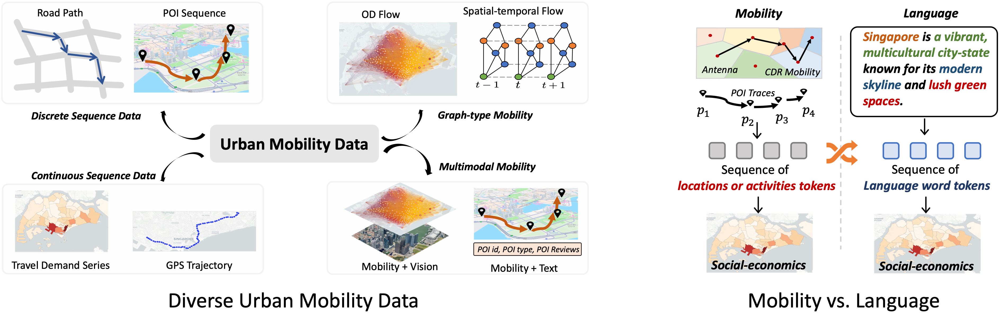
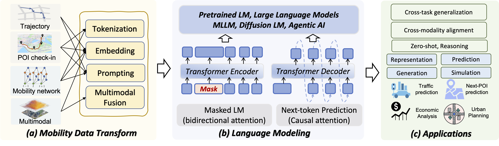
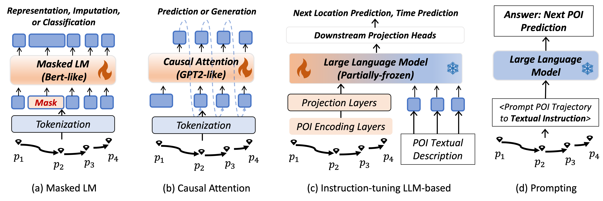
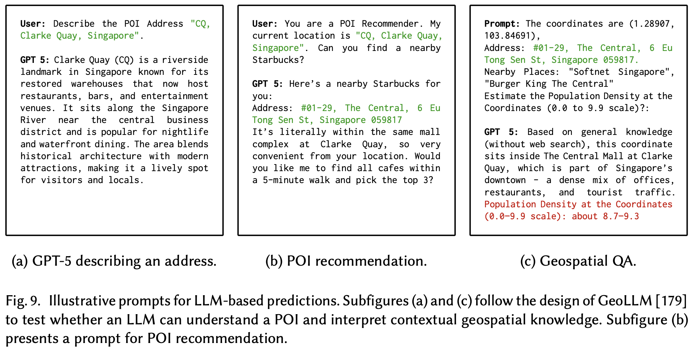
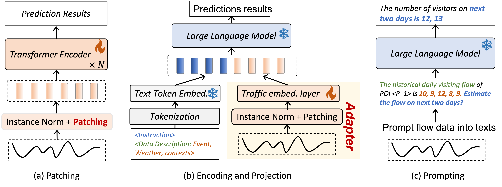
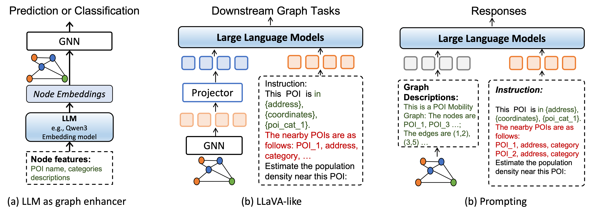
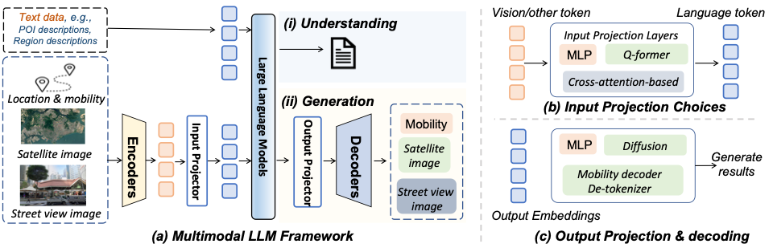

# Awesome Language Modeling for Urban Mobility
> Language Modeling for Urban Mobility: A Data-Centric Review and Guidelines

> This repository contains a collection of resources and papers on applying language modeling paradigms to urban mobility scenarios.

We propose a comprehensive and data-centric survey of language modeling for urban mobility, structured along three key dimensions: 
- **(i) How to transform heterogeneous mobility data into language model–like formats through tokenization, encoding, and prompting;** 
- **(ii) How to choose among different categories of language models, ranging from pretrained language models, large language models (LLMs), MLLMs, and diffusion models;**
- **(iii) What are the advantages of applying language modeling to urban mobility in diverse urban downstream tasks?**

## Contents

- [Related Survey](#Related-Survey)
- [1. Discrete Mobility Sequence](#1-discrete-mobility-sequence)
  - [1.1 Tokenization](#11-tokenization)
    - [1.1.2 Pretrained LM](#112-pretrained-lm)
    - [1.1.3 LLM](#113-llm)
  - [1.2 Encoding](#12-encoding)
    - [1.2.1 Attention-based](#121-attention-based)
    - [1.2.2 Pretrained LM](#122-pretrained-lm)
    - [1.2.3 LLM](#123-llm)
    - [1.2.4 Diffusion Model](#124-diffusion-model)
  - [1.3 Prompting](#13-prompting)
    - [1.3.1 LLM](#131-llm)
- [2. Continuous Mobility Sequence](#2-continuous-mobility-sequence)
  - [2.1 Discrete Tokenization (Quantization)](#21-discrete-tokenization-quantization)
    - [2.1.1 Pretrained LM](#211-pretrained-lm)
    - [2.1.2 LLM](#212-llm)
  - [2.2 Encoding](#22-encoding)
    - [2.2.1 Pretrained LM](#221-pretrained-lm)
    - [2.2.2 LLM](#222-llm)
  - [2.3 Prompting](#23-prompting)
    - [2.3.1 LLM](#231-llm)
  - [2.4 Featurization](#24-featurization)
    - [2.4.1 Diffusion Model](#241-diffusion-model)
- [3. Graph-type Mobility](#3-Graph-type-Mobility)
  - [3.1 Tokenization](#31-tokenization)
    - [3.1.1 Pretrained LM](#311-pretrained-lm)
    - [3.1.2 LLM](#312-llm)
  - [3.2 Encoding](#32-encoding)
    - [3.2.1 Pretrained LM](#321-pretrained-lm)
    - [3.2.2 LLM](#322-llm)
  - [3.3 Prompting](#33-prompting)
    - [3.3.1 LLM](#331-llm)
  - [3.4 Featurization](#34-featurization)
    - [3.4.1 Diffusion Model](#341-diffusion-model)
- [4. Multimodal Mobility Data](#4-multimodal-mobility-data)
  - [4.1 Vision and Trajectory](#41-vision-and-trajectory)
  - [4.2 Text and Trajectory](#42-text-and-trajectory)
  - [4.3 Vision and Traffic](#43-vision-and-traffic)
  - [4.4 Text and Traffic](#44-text-and-traffic)
  - [4.5 Vision and Graph](#45-vision-and-graph)
  - [4.6 Text and Graph](#46-text-and-graph)

- [Dataset](#Dataset)
- [References from General AI Communities](#References-from-General-AI-Communities)

# Related Survey
- A survey on deep learning for human mobility (2021). [[paper]](https://arxiv.org/pdf/2012.02825.pdf) [[code]](https://github.com/scikit-mobility/DeepLearning4HumanMobility)
  - Massimiliano Luca, Gianni Barlacchi, Bruno Lepri, Luca Pappalardo

- MobilityDL: a review of deep learning from trajectory data (2025). [[paper]](https://arxiv.org/pdf/2402.00732.pdf) [[code]](https://github.com/anahid1988/MobilityDL)
  - Anita Graser, Anahid Jalali, Jasmin Lampert, Axel Weißenfeld, Krzysztof Janowicz

- Deep learning for trajectory data management and mining: A survey and beyond (2024). [[paper]](https://arxiv.org/pdf/2403.14151.pdf) [[code]](https://github.com/yoshall/Awesome-Trajectory-Computing)
  - Wei Chen, Yuxuan Liang, Yuanshao Zhu, Yanchuan Chang, Kang Luo, Haomin Wen, Lei Li, Yanwei Yu, Qingsong Wen, Chao Chen, et al.

- A survey of large language models for traffic forecasting: Methods and applications (2025). [[paper]](https://doi.org/10.36227/techrxiv.174495271.19469544/v1) 
  - Qingqing Long, Shuai Liu, Ning Cao, Zhicheng Ren, Wei Ju, Chen Fang, Zhihong Zhu, Hengshu Zhu, Yuanchun Zhou

- Large language models for mobility analysis in transportation systems: A survey on forecasting tasks (2024). [[paper]](https://arxiv.org/pdf/2405.02357?)
  - Zijian Zhang, Yujie Sun, Zepu Wang, Yuqi Nie, Xiaobo Ma, Ruolin Li, Peng Sun, Xuegang Ban

- Large Language Models for Urban Mobility (2025). [[paper]](https://doi.org/10.1109/MDM65600.2025.00041)
  - Youssef Hussein, Mohamed Hemdan, Mohamed F Mokbel

- Large models for time series and spatio-temporal data: A survey and outlook (2023). [[paper]](https://arxiv.org/pdf/2310.10196.pdf) [[code]](https://github.com/qingsongedu/Awesome-TimeSeries-SpatioTemporal-LM-LLM)
  - Ming Jin, Qingsong Wen, Yuxuan Liang, Chaoli Zhang, Siqiao Xue, Xue Wang, James Zhang, Yi Wang, Haifeng Chen, Xiaoli Li, et al.

- Foundation models for spatio-temporal data science: A tutorial and survey (2025). [[paper]](https://arxiv.org/pdf/2503.13502?)
  - Yuxuan Liang, Haomin Wen, Yutong Xia, Ming Jin, Bin Yang, Flora Salim, Qingsong Wen, Shirui Pan, Gao Cong

- Unraveling Spatio-Temporal Foundation Models via the Pipeline Lens: A Comprehensive Review (2025). [[paper]](https://arxiv.org/pdf/2506.01364.pdf) [[code]](https://github.com/LMissher/Awesome-Spatio-Temporal-Foundation-Models)
  - Yuchen Fang, Hao Miao, Yuxuan Liang, Liwei Deng, Yue Cui, Ximu Zeng, Yuyang Xia, Yan Zhao, Torben Bach Pedersen, Christian S Jensen, et al.

- How can time series analysis benefit from multiple modalities? a survey and outlook (2025). [[paper]](https://arxiv.org/pdf/2503.11835.pdf) [[code]](https://github.com/AdityaLab/MM4TSA)
  - Haoxin Liu, Harshavardhan Kamarthi, Zhiyuan Zhao, Shangqing Xu, Shiyu Wang, Qingsong Wen, Tom Hartvigsen, Fei Wang, B Aditya Prakash

- Multi-modal time series analysis: A tutorial and survey (2025). [[paper]](https://arxiv.org/pdf/2503.13709.pdf) [[code]](https://github.com/UConn-DSIS/Multi-modal-Time-Series-Analysis)
  - Yushan Jiang, Kanghui Ning, Zijie Pan, Xuyang Shen, Jingchao Ni, Wenchao Yu, Anderson Schneider, Haifeng Chen, Yuriy Nevmyvaka, Dongjin Song

- Urban computing in the era of large language models (2025). [[paper]](https://arxiv.org/pdf/2504.02009.pdf) [[code]](https://github.com/HKUDS/Awesome-LLM4Urban-Papers)
  - Zhonghang Li, Lianghao Xia, Xubin Ren, Jiabin Tang, Tianyi Chen, Yong Xu, Chao Huang

- Towards urban general intelligence: A review and outlook of urban foundation models (2024). [[paper]](https://arxiv.org/pdf/2408.03732.pdf)
  - Weijia Zhang, Jindong Han, Zhao Xu, Hang Ni, Hao Liu, Hui Xiong

# Related Paper Lists

## 1. Discrete Mobility Sequence

### 1.1 Tokenization

#### 1.1.1 Pretrained LM

- **Attention**
  - MoveSim (`feng2020learning`)  Learning to simulate human mobility. KDD, 2020. [[paper]](https://dl.acm.org/doi/10.1145/3394486.3412862) [[code]](https://github.com/FIBLAB/MoveSim)
  - TPG (`luo2023timestamps`) Timestamps as prompts for geography-aware location recommendation. CIKM, 2023. [[paper]](https://arxiv.org/abs/2304.04151)  

- **Masked LM**
  - CTLE (`lin2021pre`) Pre-training context and time aware location embeddings from spatial-temporal trajectories for user next location prediction. AAAI, 2021. [[paper]](https://ojs.aaai.org/index.php/AAAI/article/view/16548) 
  - Wepos (`guo2022wepos`) Wepos: Weak-supervised indoor positioning with unlabeled wifi for on-demand delivery. IMWUT, 2022. [[paper]](https://dl.acm.org/doi/10.1145/3534574) 
  - Yang et al. (`yang2024applying`) Applying masked language model for transport mode choice behavior prediction. TR-A, 2024. [[paper]](https://www.sciencedirect.com/science/article/abs/pii/S0965856424001228) 
  - GREEN (`zhou2025grid`) Grid and road expressions are complementary for trajectory representation learning. KDD, 2025. [[paper]](https://dl.acm.org/doi/10.1145/3690624.3709272) [[code]](https://github.com/slzhou-xy/GREEN)
  - TrajBERT (`trajbert2023`) TrajBERT: BERT-Based Trajectory Recovery with Spatial-Temporal Refinement. TMC, 2023. [[paper]](https://dl.acm.org/doi/abs/10.1109/TMC.2023.3297115) 

- **Transformer Decoder**
  - MobilityGPT (`mobilitygpt2024`) MobilityGPT: Enhanced Human Mobility Modeling with a GPT model. [[paper]](https://arxiv.org/abs/2402.03264) [[code]](https://github.com/ammarhydr/MobilityGPT)
  - GeoFormer (`solatorio2023geoformer`) GeoFormer: predicting human mobility using generative pre-trained transformer (GPT). 2023. [[paper]](https://dl.acm.org/doi/10.1145/3615894.3628499) [[code]](https://github.com/avsolatorio/geoformer)
  - LMTAD (`mbuya2024trajectory`) Trajectory Anomaly Detection with Language Models. SIGSPATIAL, 2024. [[paper]](https://dl.acm.org/doi/10.1145/3678717.3691257) [[code]](https://github.com/jonathankabala/LMTAD)
  - Kobayashi et al. (`kobayashi2023modeling`) Modeling and generating human mobility trajectories using transformer with day encoding. 2023. [[paper]](https://dl.acm.org/doi/10.1145/3615894.3628506) 
  - Traj-LLM (`lan2024traj`) Traj-llm: A new exploration for empowering trajectory prediction with pre-trained large language models. IEEE Transactions on Intelligent Vehicle, 2024. [[paper]](https://arxiv.org/abs/2405.04909)
  - TrajLearn (`nadiri2025trajlearn`) TrajLearn: Trajectory Prediction Learning using Deep Generative Models. ACM Transactions on Spatial Algorithms and Systems, 2025. [[paper]](https://arxiv.org/abs/2501.00184) [[code]](https://github.com/amir-ni/trajectory-prediction)

#### 1.1.2 LLM
- GNPR-SID (`wang2025generativekdd25`) Generative Next POI Recommendation with Semantic ID. KDD, 2025. [[paper]](https://doi.org/10.1145/3711896.3736981) [[code]](https://github.com/wds1996/GNPR-SID)
- RHYTHM (`he2025rhythm`) RHYTHM: Reasoning with Hierarchical Temporal Tokenization for Human Mobility. arXiv, 2025. [[paper]](https://arxiv.org/abs/2509.23115) [[code]](https://github.com/he-h/rhythm)
- MobGLM (`zhang2024mobglm`) MobGLM: A Large Language Model for Synthetic Human Mobility Generation. SIGSPATIAL, 2024. [[paper]](https://doi.org/10.1145/3678717.3691311)
- MobilityGPT (`mobilitygpt2024`) MobilityGPT: Enhanced Human Mobility Modeling with a GPT model. [[paper]](https://arxiv.org/abs/2402.03264) [[code]](https://github.com/ammarhydr/MobilityGPT)
- Geo-Llama (`li2024geo`) Geo-llama: Leveraging llms for human mobility trajectory generation with spatiotemporal constraints. MDM, 2025. [[paper]](https://arxiv.org/abs/2408.13918) [[code]](https://github.com/Emory-AIMS/Geo-Llama)

### 1.2 Encoding

#### 1.2.1 Attention-based

- Deepmove (`feng2018deepmove`) DeepMove: Predicting human mobility with attentional recurrent networks. WWW, 2018. [[paper]](https://doi.org/10.1145/3178876.3186058) 
- STRNN (`liu2016predicting`) Predicting the next location: A recurrent model with spatial and temporal contexts. AAAI, 2016. [[paper]](https://ojs.aaai.org/index.php/AAAI/article/view/9971) 
- LSTPM (`sun2020go`) Where to go next: Modeling long-and short-term user preferences for point-of-interest recommendation. AAAI, 2020. [[paper]](https://ojs.aaai.org/index.php/AAAI/article/view/5353) 
- STAN (`Luo2021stan`) STAN: Spatio-Temporal Attention Network for Next Location Recommendation. WWW, 2021. [[paper]](https://doi.org/10.1145/3442381.3449998) [[code]](https://github.com/yingtaoluo/Spatial-Temporal-Attention-Network-for-POI-Recommendation)

#### 1.2.2 Pretrained LM

- **Masked LM**
  - LP-BERT (`suzuki2024cross`) Cross-city-aware Spatiotemporal BERT. SIGSPATIAL, 2024. [[paper]](https://dl.acm.org/doi/10.1145/3681771.3699915) 
  - TraceBERT (`crivellari2022tracebert`) Tracebert—a feasibility study on reconstructing spatial--temporal gaps from incomplete motion trajectories via bert training process on discrete location sequences. Sensors, 2022. [[paper]](https://www.mdpi.com/1424-8220/22/4/1682) 
  - CTLE (`lin2021pre`) Pre-training context and time aware location embeddings from spatial-temporal trajectories for user next location prediction. AAAI, 2021. [[paper]](https://ojs.aaai.org/index.php/AAAI/article/view/16548)
  - GREEN (`zhou2025grid`) Grid and road expressions are complementary for trajectory representation learning. KDD, 2025. [[paper]](https://dl.acm.org/doi/10.1145/3690624.3709272) [[code]](https://github.com/slzhou-xy/GREEN)

- **Causal Attention**
  - MobTCast (`xue2021mobtcast`) MobTCast: Leveraging auxiliary trajectory forecasting for human mobility prediction. NeurIPS, 2021. [[paper]](https://arxiv.org/abs/2110.01401) 
  - AttnMove (`xia2021attnmove`) Attnmove: History enhanced trajectory recovery via attentional network. AAAI, 2021. [[paper]](https://arxiv.org/abs/2101.00646) [[code]](https://github.com/XTxiatong/AttnMove)

#### 1.2.3 LLM
- LLMEmb (`liu2025llmemb`) Llmemb: Large language model can be a good embedding generator for sequential recommendation. AAAI, 2025. [[paper]](https://arxiv.org/abs/2409.19925) [[code]](https://github.com/Applied-Machine-Learning-Lab/LLMEmb) 
- Mobility-LLM (`mobilityllm2024`) Mobility-llm: Learning visiting intentions and travel preference from human mobility data with large language models. NeurIPS, 2024. [[paper]](https://arxiv.org/abs/2411.00823?) [[code]](https://github.com/LetianGong/Mobility-LLM)
- NextLocLLM (`nextlocllm2025`) NextlocLLM: Next Location Prediction Using LLMs. arXiv, 2025. [[paper]](https://arxiv.org/html/2410.09129v1) [[code]](https://anonymous.4open.science/r/NexelocLLM-1CF8/)
- GSTM-HMU (`luo2025gstm`) GSTM-HMU: Generative Spatio-Temporal Modeling for Human Mobility Understanding. arXiv, 2025. [[paper]](https://arxiv.org/abs/2509.19135)

#### 1.2.4 Diffusion Model
- Cardiff (`guo2025leveraging`) Leveraging the Spatial Hierarchy: Coarse-to-fine Trajectory Generation via Cascaded Hybrid Diffusion. arXiv preprint arXiv:2507.13366, 2025. [[paper]](https://arxiv.org/abs/2507.13366) [[code]](https://github.com/urban-mobility-generation/Cardiff)
- Diff-POI (`qin2023diffusion`) A Diffusion Model for POI Recommendation. ACM Transactions on Information Systems, 2023. [[paper]](https://doi.org/10.1145/3624475) 
- AutoSTDiff (`xu2025autostdiff`) AutoSTDiff: Autoregressive Spatio-Temporal Denoising Diffusion Model for Asynchronous Trajectory Generation. SIAM SDM, 2025. [[paper]](https://doi.org/10.1137/1.9781611978520.58) [[code]](https://github.com/Rongchao98/AutoSTDiff)
- DiffMove (`long2025diffmove`) DiffMove: Group Mobility Tendency Enhanced Trajectory Recovery via Diffusion Model. arXiv preprint arXiv:2503.18302, 2025. [[paper]](https://arxiv.org/abs/2503.18302) 
- GenMove (`long2025one`) One Fits All: General Mobility Trajectory Modeling via Masked Conditional Diffusion. arXiv preprint arXiv:2501.13347, 2025. [[paper]](https://arxiv.org/abs/2501.13347) 
- Diff-DGMN (`zuo2024diff`) Diff-DGMN: A Diffusion-Based Dual Graph Multiattention Network for POI Recommendation. IEEE Internet of Things Journal, 2024. [[paper]](https://doi.org/10.1109/JIOT.2024.3446048) [[code]](https://github.com/JKZuo/Diff-DGMN)
- DCPR (`long2024diffusion`) Diffusion-Based Cloud-Edge-Device Collaborative Learning for Next POI Recommendations. KDD, 2024. [[paper]](https://doi.org/10.1145/3637528.3671743) 
- Traveller (`luo2025traveller`) Traveller: Travel-Pattern Aware Trajectory Generation via Autoregressive Diffusion Models. Information Fusion, 2025. [[paper]](https://doi.org/10.1016/j.inffus.2025.103766) [[code]](https://github.com/YuxiaoLuo0013/Traveller)
- TrajGDM (`chu2024simulating`) Simulating Human Mobility with a Trajectory Generation Framework Based on Diffusion Model. International Journal of Geographical Information Science, 2024. [[paper]](https://doi.org/10.1080/13658816.2024.2312199) [[code]](https://github.com/chuchen2017/TrajGDM)

### 1.3 Prompting

#### 1.3.1 LLM

- **As Representor**
  - Poi-enhancer (`cheng2025poi`) Poi-enhancer: An LLM-based semantic enhancement framework for POI representation learning. AAAI, 2025. [[paper]](https://doi.org/10.1609/aaai.v39i11.33252) [[code]](https://github.com/Applied-Machine-Learning-Lab/POI-Enhancer)
  - LLM-Mob (`wang2023would`) Where would i go next? large language models as human mobility predictors. arXiv preprint arXiv:2308.15197, 2023. [[paper]](https://arxiv.org/abs/2308.15197) [[code]](https://github.com/xlwang233/LLM-Mob)
  - TrajCogn (`zhou2024trajcogn`) TrajCogn: Leveraging LLMs for Cognizing Movement Patterns and Travel Purposes from Trajectories. arXiv preprint arXiv:2405.12459, 2024. [[paper]](https://arxiv.org/abs/2405.12459) [[code]](https://anonymous.4open.science/r/TrajCogn-5021)

- **As Predictor**
  - TPP-LLM (`liu2024tpp`) Tpp-llm: Modeling temporal point processes by efficiently fine-tuning large language models. arXiv preprint arXiv:2410.02062, 2024. [[paper]](https://arxiv.org/abs/2410.02062) [[code]](https://github.com/zefang-liu/TPP-LLM)
  - CoMaPOI (`zhong2025comapoi`) CoMaPOI: A Collaborative Multi-Agent Framework for Next POI Prediction Bridging the Gap Between Trajectory and Language. SIGIR, 2025. [[paper]](https://doi.org/10.1145/3726302.3729930) [[code]](https://github.com/Chips98/CoMaPOI)
  - AgentMove (`feng2024agentmove`) Agentmove: A large language model based agentic framework for zero-shot next location prediction. NAACL, 2024. [[paper]](https://arxiv.org/abs/2408.13986) [[code]](https://github.com/tsinghua-fib-lab/AgentMove)
  - Feng et al. (`feng2024move`) Where to move next: Zero-shot generalization of llms for next poi recommendation. IEEE CAI, 2024. [[paper]](https://doi.org/10.1109/CAI59869.2024.00277) [[code]](https://github.com/LLMMove/LLMMove)
  - LLM4Poi (`li2024large`) Large language models for next point-of-interest recommendation. SIGIR, 2024. [[paper]](https://doi.org/10.1145/3626772.3657840) [[code]](https://github.com/neolifer/LLM4POI)
  - CSA-Rec (`wang2025collaborative`) Collaborative Semantics-Assisted Large Language Models for Next POI Recommendation. ICASSP, 2025. [[paper]](https://doi.org/10.1109/ICASSP49660.2025.10889625)
  - LAMP (`balsebre2024lamp`) LAMP: A language model on the map. arXiv preprint arXiv:2403.09059, 2024. [[paper]](https://arxiv.org/abs/2403.09059) [[code]](https://github.com/PasqualeTurin/LAMP)
  - Zhang et al. (`zhang2023large`) Large Language Models for Spatial Trajectory Patterns Mining.(2023). ACM SIGSPATIAL International Workshop on Geospatial Anomaly Detection, 2024. [[paper]](https://arxiv.org/abs/2310.04942)
  - Mo et al. (`mo2023large`) Large language models for travel behavior prediction. arXiv preprint arXiv:2312.00819, 2023. [[paper]](https://arxiv.org/abs/2312.00819)
  - POI GPT (`kim2024poi`) POI GPT: Extracting POI information from social media text data. ISPRS Archives, 2024. [[paper]](https://doi.org/10.5194/isprs-archives-XLVIII-4-W10-2024-113-2024) [[code]](https://chatgpt.com/g/g-KCAVctWUh-poigpt)
  - Chen et al. (`chen2025toward`) Toward interactive next location prediction driven by large language models. IEEE Transactions on Computational Social Systems, 2025. [[paper]](https://doi.org/10.1109/TCSS.2024.3522965)
  - DelayPTC-LLM (`chen2024delayptc`) Delayptc-llm: Metro passenger travel choice prediction under train delays with large language models. arXiv preprint arXiv:2410.00052, 2024. [[paper]](https://arxiv.org/abs/2410.00052)

- **Generator**
  - Liu et al. (`liu2025aligning`) Aligning LLM agents with human learning and adjustment behavior: a dual agent approach. arXiv, 2025. [[paper]](https://arxiv.org/abs/2511.00993) 
  - CoPB (`shao2024chain`) Chain-of-planned-behaviour workflow elicits few-shot mobility generation in llms. arXiv, 2024. [[paper]](https://arxiv.org/abs/2402.09836) [[code]](https://anonymous.4open.science/r/CoPB)
  - Liu et al. (`liu2023can`) Can language models be used for real-world urban-delivery route optimization?. The Innovation, 2023. [[paper]](https://www.sciencedirect.com/science/article/pii/S2666675823001480) 
  - Bhandari et al. (`bhandari2024urban`) Urban mobility assessment using llms. SIGSPATIAL, 2024. [[paper]](https://arxiv.org/abs/2409.00063) 
  - Zheng et al. (`zheng2025urban`) Urban planning in the era of large language models. Nature computational science, 2025. [[paper]](https://www.nature.com/articles/s43588-025-00846-1) 

- **LLM Agents**
  - LLM-HABG (`meng2025behavior`) Behavior Generation for Heterogeneous Agents in Urban Simulation Deduction: A Multi-Stage Approach Based on Large Language Models. CCSSTA, 2025. [[paper]](https://doi.org/10.1109/IEEECONF65522.2025.11136878)
  - PathGPT (`marcelyn2025pathgpt`) PathGPT: Leveraging Large Language Models for Personalized Route Generation. arXiv preprint arXiv:2504.05846, 2025. [[paper]](https://arxiv.org/abs/2504.05846) [[code]](https://github.com/Kuramenai/PathGPT/)
  - LLMTraveler (`wang2024ai`) Ai-driven day-to-day route choice. arXiv preprint arXiv:2412.03338, 2024. [[paper]](https://arxiv.org/abs/2412.03338) [[code]](https://github.com/georgewanglz2019/LLMTraveler)
  - GATSim (`liu2025gatsim`) GATSim: Urban Mobility Simulation with Generative Agents. arXiv preprint arXiv:2506.23306, 2025. [[paper]](https://arxiv.org/abs/2506.23306) [[code]](https://github.com/qiliuchn/gatsim)
  - MobAgent (`li2024more`) Be more real: Travel diary generation using llm agents and individual profiles. arXiv preprint arXiv:2407.18932, 2024. [[paper]](https://arxiv.org/abs/2407.18932)
  - CitySim (`bougie2025citysim`) CitySim: Modeling Urban Behaviors and City Dynamics with Large-Scale LLM-Driven Agent Simulation. EMNLP, 2025. [[paper]](https://arxiv.org/abs/2506.21805)
  - TravelPlanner (`xie2024travelplanner`) Travelplanner: A benchmark for real-world planning with language agents. arXiv preprint arXiv:2402.01622, 2024. [[paper]](https://arxiv.org/abs/2402.01622) [[code]](https://osu-nlp-group.github.io/TravelPlanner)
  - IDM-GPT (`yang2025independent`) Independent mobility gpt (idm-gpt): A self-supervised multi-agent large language model framework for customized traffic mobility analysis using machine learning models. arXiv preprint arXiv:2502.18652, 2025. [[paper]](https://arxiv.org/abs/2502.18652)

## 2. Continuous Mobility Sequence

### 2.1 Discrete Tokenization (Quantization)

#### 2.1.1 Pretrained LM

- **Encoder-based (BERT-like)**
  - Giuliari (`giuliari2021transformer`) Transformer networks for trajectory forecasting. ICPR, 2021. [[paper]](https://doi.org/10.1109/ICPR48806.2021.9412190) [[code]](https://github.com/FGiuliari/Trajectory-Transformer)
  - BERT4Traj (`yang2025bert4traj`) BERT4Traj: Transformer Based Trajectory Reconstruction for Sparse Mobility Data. arXiv preprint arXiv:2507.03062, 2025. [[paper]](https://arxiv.org/abs/2507.03062)

- **Decoder-based (GPT-like)**
  - MotionLM (`seff2023motionlm`) MotionLM: Multi-agent motion forecasting as language modeling. ICCV, 2023. [[paper]](https://openaccess.thecvf.com/content/ICCV2023/papers/Seff_MotionLM_Multi-Agent_Motion_Forecasting_as_Language_Modeling_ICCV_2023_paper.pdf)
  - RAW (`zhang2023regions`) Regions are who walk them: a large pre-trained spatiotemporal model based on human mobility for ubiquitous urban sensing. arXiv preprint arXiv:2311.10471, 2023. [[paper]](https://arxiv.org/abs/2311.10471) [[code]](https://github.com/Rising0321/RAW)

- **Encoder–Decoder-based**
  - UniTraj (`zhu2024unitraj`) UniTraj: Learning a universal trajectory foundation model from billion-scale worldwide traces. arXiv preprint arXiv:2411.03859, 2024. [[paper]](https://arxiv.org/abs/2411.03859) [[code]](https://github.com/Yasoz/UniTraj)

#### 2.1.2 LLM
- LMTraj (`bae2024can`) Can language beat numerical regression? language-based multimodal trajectory prediction. CVPR, 2024. [[paper]](https://openaccess.thecvf.com/content/CVPR2024/papers/Bae_Can_Language_Beat_Numerical_Regression_Language-Based_Multimodal_Trajectory_Prediction_CVPR_2024_paper.pdf) [[code]](https: //github.com/inhwanbae/LMTrajectory)
- RouteLLM (`hallgarten2025routellm`) RouteLLM: A Large Language Model with Native Route Context Understanding to Enable Context-Aware Reasoning. IMWUT, 2025. [[paper]](https://doi.org/10.1145/3749552) [[code]](https://huggingface.co/RouteLLM-Dataset)
- QT-Mob (`chen2025enhancing`) Enhancing Large Language Models for Mobility Analytics with Semantic Location Tokenization. KDD, 2025. [[paper]](https://doi.org/10.1145/3711896.3736937) [[code]](https://github.com/shadowfall09/QT-Mob)
- CAMS (`du2025cams`) CAMS: A CityGPT-Powered Agentic Framework for Urban Human Mobility Simulation. arXiv preprint arXiv:2506.13599, 2025. [[paper]](https://arxiv.org/abs/2506.13599)
- AutoTimes (`liu2024autotimes`) AutoTimes: Autoregressive time series forecasters via large language models. NeurIPS, 2024. [[paper]](https://openreview.net/forum?id=FOvZztnp1H) [[code]](https://github.com/thuml/AutoTimes)

### 2.2 Encoding

#### 2.2.1 Pretrained LM
- BERT4Traj (`yang2025bert4traj`) BERT4Traj: Transformer Based Trajectory Reconstruction for Sparse Mobility Data. arXiv preprint arXiv:2507.03062, 2025. [[paper]](https://arxiv.org/abs/2507.03062)
- EETG-SVAE (`zhang2025end`) End-to-end Trajectory Generation - Contrasting Deep Generative Models and Language Models. ACM Transactions on Spatial Algorithms and Systems, 2025. [[paper]](https://doi.org/10.1145/3716892)
- Musleh et al. (`musleh2022towards`) Towards a Unified Deep Model for Trajectory Analysis. SIGSPATIAL, 2022. [[paper]](https://doi.org/10.1145/3557915.3565529)
- UrbanGPT (`li2024urbangpt`) UrbanGPT: Spatio-Temporal Large Language Models. KDD, 2024. [[paper]](https://doi.org/10.1145/3637528.3671578) [[code]](https://github.com/HKUDS/UrbanGPT)
- UniST (`yuan2024unist`) UniST: A Prompt-Empowered Universal Model for Urban Spatio-Temporal Prediction. KDD, 2024. [[paper]](https://doi.org/10.1145/3637528.3671662) [[code]](https://github.com/tsinghua-fib-lab/UniST)
- FlashST (`li2024flashst`) FlashST: A Simple and Universal Prompt-Tuning Framework for Traffic Prediction. arXiv preprint arXiv:2405.17898, 2024. [[paper]](https://arxiv.org/abs/2405.17898) [[code]](https://github.com/HKUDS/FlashST)
- Traffic-Twitter Transformer (`tsai2022traffic`) Traffic-Twitter Transformer: A Nature Language Processing-joined Framework for Network-wide Traffic Forecasting. arXiv preprint arXiv:2206.11078, 2022. [[paper]](https://arxiv.org/abs/2206.11078)
- FlowDistill (`yu2025flowdistill`) FlowDistill: Scalable Traffic Flow Prediction via Distillation from LLMs. arXiv preprint arXiv:2504.02094, 2025. [[paper]](https://arxiv.org/abs/2504.02094) [[code]](https://github.com/zxc2012/FlowDistill)
- Cao et al. (`cao2021bert`) BERT-Based Deep Spatial-Temporal Network for Taxi Demand Prediction. T-ITS, 2021. [[paper]](https://doi.org/10.1109/TITS.2021.3122114)
- Ma et al. (`ma2025urban`) Urban rail transit passenger flow prediction using large language model under multi-source spatiotemporal data fusion. Physica A: Statistical Mechanics and its Applications, 2025. [[paper]](https://doi.org/10.1016/j.physa.2025.130823)
- TrafficBERT (`jin2021trafficbert`) TrafficBERT: Pre-trained model with large-scale data for long-range traffic flow forecasting. Expert Systems with Applications, 2021. [[paper]](https://doi.org/10.1016/j.eswa.2021.115738)
- ST-LLM+ (`liu2025st`) ST-LLM+: Graph Enhanced Spatio-Temporal Large Language Models for Traffic Prediction. IEEE Transactions on Knowledge and Data Engineering, 2025. [[paper]](https://doi.org/10.1109/TKDE.2025.3570705) [[code]](https://github.com/kethmih/ST-LLM-Plus)
- MDTI (`liu2025multimodal`) Multimodal Trajectory Representation Learning for Travel Time Estimation. arXiv preprint arXiv:2510.05840, 2025. [[paper]](https://arxiv.org/abs/2510.05840) [[code]](https://github.com/freshhxy/MDTI/)

#### 2.2.2 LLM
- TPLLM (`ren2024tpllm`) TPLLM: A traffic prediction framework based on pretrained large language models. arXiv preprint arXiv:2403.02221, 2024. [[paper]](https://arxiv.org/abs/2403.02221) 
- LLM-TFP (`cheng2025llm`) LLM-TFP: Integrating large language models with spatio-temporal features for urban traffic flow prediction. Applied Soft Computing, 2025. [[paper]](https://doi.org/10.1016/j.asoc.2025.113174) [[code]](https://github.com/chtkg/LLM-TFP)
- Liao et al. (`liao2025next`) Next-Generation Travel Demand Modeling with a Generative Framework for Household Activity Coordination. arXiv preprint arXiv:2507.08871, 2025. [[paper]](https://arxiv.org/abs/2507.08871) 

### 2.3 Prompting

#### 2.3.1 LLM
- **Representation and Mining**
  - Zhang et al. (`zhang2024large`) Large language models for spatial trajectory patterns mining. SIGSPATIAL, 2024. [[paper]](https://doi.org/10.1145/3681765.3698467) [[code]](https://github.com/onspatial/LLM-outlier-detection)
  - GPT-J (`ji2024evaluating`) Evaluating the Effectiveness of Large Language Models in Representing and Understanding Movement Trajectories. arXiv preprint arXiv:2409.00335, 2024. [[paper]](https://arxiv.org/abs/2409.00335) 
  - GeoLLM (`manvi2023geollm`) Geollm: Extracting geospatial knowledge from large language models. arXiv preprint arXiv:2310.06213, 2023. [[paper]](https://arxiv.org/abs/2310.06213) [[code]](https://rohinmanvi.github.io/GeoLLM)
  - AuxMobLCast (`xue2022leveraging`) Leveraging language foundation models for human mobility forecasting. SIGSPATIAL, 2022. [[paper]](https://doi.org/10.1145/3557915.3561026) [[code]](https://github.com/cruiseresearchgroup/AuxMobLCast)
  - Wang et al. (`wang2025event`) Event-aware analysis of cross-city visitor flows using large language models and social media data. arXiv preprint arXiv:2505.03847, 2025. [[paper]](https://arxiv.org/abs/2505.03847) 

- **Prediction**
  - LLM-MPE (`liang2024exploring`) Exploring large language models for human mobility prediction under public events. Computers, Environment and Urban Systems, 2024. [[paper]](https://doi.org/10.1016/j.compenvurbsys.2024.102153) 
  - STCInterLLM (`li2025causal`) Causal Intervention Is What Large Language Models Need for Spatio-Temporal Forecasting. IEEE Transactions on Cybernetics, 2025. [[paper]](https://doi.org/10.1109/TCYB.2025.3569333) [[code]](https://github.com/lishijie15/STCInterLLM)
  - xTP-LLM (`guo2024towards`) Towards explainable traffic flow prediction with large language models. Communications in Transportation Research, 2024. [[paper]](https://doi.org/10.1016/j.commtr.2024.100150) [[code]](https://github.com/Guoxs/xTP-LLM)
  - Cai et al. (`cai2024temporal`) Temporal-Spatial Traffic Flow Prediction Model Based on Prompt Learning. ISPRS International Journal of Geo-Information, 2025. [[paper]](https://doi.org/10.3390/ijgi14010011) 
  - LLM4PT (`wu2025llm4pt`) LLM4PT: A large language model-based system for flexible and explainable public transit demand prediction. Computers & Industrial Engineering, 2025. [[paper]](https://doi.org/10.1016/j.cie.2025.111449) 
  - TransLLM (`leng2025transllm`) TransLLM: A Unified Multi-Task Foundation Framework for Urban Transportation via Learnable Prompting. arXiv preprint arXiv:2508.14782, 2025. [[paper]](https://arxiv.org/abs/2508.14782) [[code]](https://github.com/BiYunying/TransLLM)

- **Generation**
  - LLMob (`jiawei2024large`) Large language models as urban residents: An llm agent framework for personal mobility generation. NeurIPS, 2024. [[paper]](https://arxiv.org/abs/2402.14744) [[code]](https://github.com/Wangjw6/LLMob/)

### 2.4 Featurization

#### 2.4.1 Diffusion Model
- CoDiffMob (`codiffmob2025`) Noise Matters: Diffusion Model-Based Urban Mobility Generation with Collaborative Noise Priors. WWW, 2025. [[paper]](https://doi.org/10.1145/3696410.3714516) [[code]](https://github.com/tsinghua-fib-lab/CoDiffMob)
- ControlTraj (`zhu2024controltraj`) ControlTraj: Controllable Trajectory Generation with Topology-Constrained Diffusion Model. KDD, 2024. [[paper]](https://doi.org/10.1145/3637528.3671866) [[code]](https://github.com/Yasoz/ControlTraj)
- DiffTraj (`difftraj2023`) DiffTraj: Generating GPS Trajectory with Diffusion Probabilistic Model. NeurIPS, 2023. [[paper]](https://proceedings.neurips.cc/paper_files/paper/2023/file/cd9b4a28fb9eebe0430c3312a4898a41-Paper-Conference.pdf) [[code]](https://github.com/Yasoz/DiffTraj)
- Cardiff (`guo2025leveraging`) Leveraging the Spatial Hierarchy: Coarse-to-fine Trajectory Generation via Cascaded Hybrid Diffusion. arXiv preprint arXiv:2507.13366, 2025. [[paper]](https://arxiv.org/abs/2507.13366) [[code]](https://github.com/urban-mobility-generation/Cardiff)
- UniMob (`long2025universal`) A Universal Model for Human Mobility Prediction. KDD, 2025. [[paper]](https://doi.org/10.1145/3690624.3709236) [[code]](https://github.com/tsinghua-fib-lab/UniMob)

## 3. Graph-type Mobility

### 3.1 Tokenization

#### 3.1.1 Pretrained LM
- UniFlow (`yuan2024uniflow`) UniFlow: A Foundation Model for Unified Urban Spatio-Temporal Flow Prediction. arXiv preprint arXiv:2411.12972, 2024. [[paper]](https://arxiv.org/abs/2411.12972) [[code]](https://github.com/YuanYuan98/UniFlow)
- RePST (`wang2024repst`) RePST: Language Model Empowered Spatio-Temporal Forecasting via Semantic-Oriented Reprogramming. IJCAI, 2025. [[paper]](https://www.ijcai.org/proceedings/2025/0374.pdf) [[code]](https://github.com/usail-hkust/REPST)
- CompactST (`han2025scalable`) Scalable Pre-Training of Compact Urban Spatio-Temporal Predictive Models on Large-Scale Multi-Domain Data. VLDB, 2025. [[paper]](https://doi.org/10.14778/3734839.3734851) [[code]](https://github.com/usail-hkust/CompactST)
- STD-PLM (`huang2025std`) Std-PLM: Understanding Both Spatial and Temporal Properties of Spatial-Temporal Data with PLM. AAAI, 2025. [[paper]](https://doi.org/10.1609/aaai.v39i11.33286) [[code]](https://github.com/Hyheng/STD-PLM)

#### 3.1.2 LLM
- STG-LLM (`liu2024can`) Can Large Language Models Capture Human Travel Behavior? Evidence and Insights on Mode Choice. SSRN, 2024. [[paper]](https://papers.ssrn.com/sol3/papers.cfm?abstract_id=4937575)
- ST-LLM (`liu2024spatial`) Spatial-Temporal Large Language Model for Traffic Prediction. MDM, 2024. [[paper]](https://doi.org/10.1109/MDM61037.2024.00025) [[code]](https://github.com/ChenxiLiu-HNU/ST-LLM)

### 3.2 Encoding

#### 3.2.1 Pretrained LM
- STGormer (`zhou2024navigating`) Navigating Spatio-Temporal Heterogeneity: A Graph Transformer Approach for Traffic Forecasting. arXiv preprint arXiv:2408.10822, 2024. [[paper]](https://arxiv.org/abs/2408.10822) [[code]](https://github.com/jasonz5/STGormer)
- STGLLM-E (`rong2024edge`) Edge Computing Enabled Large-Scale Traffic Flow Prediction With GPT in Intelligent Autonomous Transport System for 6G Network. T-ITS, 2024. [[paper]](https://doi.org/10.1109/TITS.2024.3456890)
- CityCAN (`wang2024citycan`) CityCAN: Causal Attention Network for Citywide Spatio-Temporal Forecasting. WSDM, 2024. [[paper]](https://doi.org/10.1145/3616855.3635764)
- STTNs (`xu2020spatial`) Spatial-Temporal Transformer Networks for Traffic Flow Forecasting. arXiv preprint arXiv:2001.02908, 2020. [[paper]](https://arxiv.org/abs/2001.02908)
- ST-LINK (`jeon2025st`) ST-LINK: Spatially-Aware Large Language Models for Spatio-Temporal Forecasting. CIKM, 2025. [[paper]](https://arxiv.org/abs/2509.13753) [[code]](http://github.com/HyoTaek98/ST_LINK)

#### 3.2.2 LLM
- UrbanGPT (`li2024urbangpt`) UrbanGPT: Spatio-temporal large language models. KDD, 2024. [[paper]](https://doi.org/10.1145/3637528.3671578) [[code]](https://github.com/HKUDS/UrbanGPT)

### 3.3 Prompting

#### 3.3.1 LLM
- LEAF (`zhao2024embracing`) Embracing large language models in traffic flow forecasting. Findings of the Association for Computational Linguistics: ACL 2025, 2025. [[paper]](https://arxiv.org/abs/2412.12201) [[code]](https://github.com/YushengZhao/LEAF)
- LLMCOD (`yu2024harnessing`) Harnessing llms for cross-city od flow prediction. SIGSPATIAL, 2024. [[paper]](https://doi.org/10.1145/3678717.3691308) 
- TraffiCoT-R (`alsahfi2025trafficot`) TraffiCoT-R: A framework for advanced spatio-temporal reasoning in large language models. Alexandria Engineering Journal, 2025. [[paper]](https://doi.org/10.1016/j.aej.2025.05.027) 

### 3.4 Featurization

#### 3.4.1 Diffusion Model
- DiffODGen (`rong2023complexity`) Complexity-aware large scale origin-destination network generation via diffusion model. arXiv preprint arXiv:2306.04873, 2023. [[paper]](https://arxiv.org/abs/2306.04873) 
- OpenDiff (`chai2024diffusion`) Diffusion model-based mobile traffic generation with open data for network planning and optimization. KDD, 2024. [[paper]](https://doi.org/10.1145/3637528.3671544) [[code]](https://github.com/impchai/OpenDiff-diffusion-model-with-open-data)
- Rong et al. (`ronglarge`) A Large-scale Dataset and Benchmark for Commuting Origin-Destination Flow Generation. ICLR, 2025. [[paper]](https://openreview.net/forum?id=WeJEidTzff) [[code]](https://github.com/tsinghua-fib-lab/CommutingODGen-Dataset)

## 4. Multimodal Mobility Data

### 4.1 Vision and Trajectory
- UrbanLLaVA (`feng2025urbanllava`) UrbanLLaVA: A Multi-modal Large Language Model for Urban Intelligence with Spatial Reasoning and Understanding. arXiv preprint arXiv:2506.23219, 2025. [[paper]](https://arxiv.org/abs/2506.23219) [[code]](https://github.com/tsinghua-fib-lab/UrbanLLaVA)
- Traj-MLLM (`liu2025traj`) Traj-MLLM: Can Multimodal Large Language Models Reform Trajectory Data Mining?. arXiv preprint arXiv:2509.00053, 2025. [[paper]](https://arxiv.org/abs/2509.00053)
- Flame (`xu2025flame`) Flame: Learning to Navigate with Multimodal LLM in Urban Environments. AAAI, 2025. [[paper]](https://doi.org/10.1609/aaai.v39i9.32974) [[code]](https://github.com/xyz9911/FLAME)
- VLMLocPredictor (`zhang2025eyes`) Eyes Will Shut: A Vision-Based Next GPS Location Prediction Model by Reinforcement Learning from Visual Map Feed Back. arXiv preprint arXiv:2507.18661, 2025. [[paper]](https://arxiv.org/abs/2507.18661) [[code]](https://github.com/Rising0321/VLMLocPredictor)
- MapGPT (`chen2024mapgpt`) MapGPT: Map-guided Prompting with Adaptive Path Planning for Vision-and-Language Navigation. Annual Meeting of the Association for Computational Linguistics, 2024. [[paper]](https://arxiv.org/abs/2401.07314) [[code]](https://chen-judge.github.io/MapGPT/)
- UGI (`xu2023urban`) Urban Generative Intelligence (UGI): A Foundational Platform for Agents in Embodied City Environment. arXiv preprint arXiv:2312.11813, 2023. [[paper]](https://arxiv.org/abs/2312.11813) [[code]](https://github.com/tsinghua-fib-lab/UGI)
- CityBench (`feng2025citybench`) CityBench: Evaluating the Capabilities of Large Language Models as World Models for Urban Tasks. KDD, 2025. [[paper]](https://doi.org/10.1145/3711896.3737375) [[code]](https://github.com/tsinghua-fib-lab/CityBench)
- LLM-enhanced POI recommendation (`wang2025beyond`) Beyond Visit Trajectories: Enhancing POI Recommendation via LLM-Augmented Text and Image Representations. RecSys, 2025. [[paper]](https://doi.org/10.1145/3705328.3748014) [[code]](https://github.com/wzehui/LLM-Augmented-POIRec.git)

### 4.2 Text and Trajectory
- TrajSceneLLM (`ji2025trajscenellm`) TrajSceneLLM: A Multimodal Perspective on Semantic GPS Trajectory Analysis. arXiv preprint arXiv:2506.16401, 2025. [[paper]](https://arxiv.org/abs/2506.16401) [[code]](https://github.com/februarysea/TrajSceneLLM) 
- Path-LLM (`wei2025path`) Path-LLM: A Multi-Modal Path Representation Learning by Aligning and Fusing with Large Language Models. WWW, 2025. [[paper]](https://doi.org/10.1145/3696410.3714744) [[code]](https://anonymous.4open.science/r/Path-LLM-F053)
- Trajectory-LLM (`yang2025trajectory`) Trajectory-LLM: A Language-Based Data Generator for Trajectory Prediction in Autonomous Driving. ICLR, 2025. [[paper]](https://openreview.net/forum?id=UapxTvxB3N) [[code]](https://github.com/TJU-IDVLab/Traj-LLM)
- TrajAgent (`du2024trajagent`) TrajAgent: An LLM-based Agent Framework for Automated Trajectory Modeling via Collaboration of Large and Small Models. arXiv preprint arXiv:2410.20445, 2024. [[paper]](https://arxiv.org/abs/2410.20445) [[code]](https://github.com/tsinghua-fib-lab/TrajAgent)
- CoAST (`zhai2025cognitive`) Cognitive-Aligned Spatio-Temporal Large Language Models For Next Point-of-Interest Prediction. arXiv preprint arXiv:2510.14702, 2025. [[paper]](https://arxiv.org/abs/2510.14702)
- CityGPT (`feng2025citygpt`) CityGPT: Empowering Urban Spatial Cognition of Large Language Models. KDD, 2025. [[paper]](https://doi.org/10.1145/3711896.3736878) [[code]](https://github.com/tsinghua-fib-lab/CityGPT)
- POI-Enhancer (`cheng2025poi`) POI-Enhancer: An LLM-based Semantic Enhancement Framework for POI Representation Learning. AAAI, 2025. [[paper]](https://doi.org/10.1609/aaai.v39i11.33252) [[code]](https://github.com/Applied-Machine-Learning-Lab/POI-Enhancer)
- D2A (`wang2024simulating`) Simulating Human-like Daily Activities with Desire-driven Autonomy. arXiv preprint arXiv:2412.06435, 2024. [[paper]](https://arxiv.org/abs/2412.06435) [[code]](https://sites.google.com/view/desire-driven-autonomy)

### 4.3 Vision and Traffic
- Vision-LLM (`yang2025vision`) Vision-LLMs for Spatiotemporal Traffic Forecasting. arXiv preprint arXiv:2510.11282, 2025. [[paper]](https://arxiv.org/abs/2510.11282)
- OpenDiff (`chai2024diffusion`) Diffusion Model-based Mobile Traffic Generation with Open Data for Network Planning and Optimization. KDD, 2024. [[paper]](https://doi.org/10.1145/3637528.3671544) [[code]](https://github.com/impchai/OpenDiff-diffusion-model-with-open-data)
- LSDM (`zhang2025lsdm`) LSDM: LLM-Enhanced Spatio-temporal Diffusion Model for Service-Level Mobile Traffic Prediction. arXiv preprint arXiv:2507.17795, 2025. [[paper]](https://arxiv.org/abs/2507.17795) [[code]](https://github.com/SoftYuaneR/LSDM)

### 4.4 Text and Traffic
- ChatTraffic (`zhang2024chattraffic`) ChatTraffic: Text-to-Traffic Generation via Diffusion Model. T-ITS, 2024. [[paper]](https://doi.org/10.1109/TITS.2024.3510402) [[code]](https://github.com/ChyaZhang/ChatTraffic)
- ChatSUMO (`li2024chatsumo`) ChatSUMO: Large Language Model for Automating Traffic Scenario Generation in Simulation of Urban Mobility. IEEE Transactions on Intelligent Vehicles, 2024. [[paper]](https://doi.org/10.1109/TIV.2024.3508471)
- UrbanMind (`liu2025urbanmind`) UrbanMind: Urban Dynamics Prediction with Multifaceted Spatial-Temporal Large Language Models. KDD, 2025. [[paper]](https://doi.org/10.1145/3711896.3737177) [[code]](https://doi.org/10.5281/zenodo.15484938)
- T3 (`han2024event`) Event Traffic Forecasting with Sparse Multimodal Data. ACM MM, 2024. [[paper]](https://doi.org/10.1145/3664647.3680706) [[code]](https://github.com/2448845600/EventTrafficForecasting)
- GPT4MTS (`jia2024gpt4mts`) GPT4MTS: Prompt-based Large Language Model for Multimodal Time-Series Forecasting. AAAI, 2024. [[paper]](https://doi.org/10.1609/aaai.v38i21.30383)

### 4.5 Vision and Graph
- Sat2Flow (`wang2025sat2flow`) Sat2Flow: A Structure-Aware Diffusion Framework for Human Flow Generation from Satellite Imagery. arXiv preprint arXiv:2508.19499, 2025. [[paper]](https://arxiv.org/abs/2508.19499) [[code]](https://github.com/ai4city-sztu/Sat2Flow)
- GlODGen (`rong2025satellites`) Satellites Reveal Mobility: A Commuting Origin-Destination Flow Generator for Global Cities. arXiv preprint arXiv:2505.15870, 2025. [[paper]](https://arxiv.org/abs/2505.15870) [[code]](https://github.com/tsinghua-fib-lab/generate-od-pubtools)

### 4.6 Text and Graph
- SeMob (`chen2025semob`) SeMob: Semantic Synthesis for Dynamic Urban Mobility Prediction. EMNLP, 2025. [[paper]](https://aclanthology.org/2025.emnlp-main.775.pdf) [[code]](https://github.com/ICrescendo/SeMob)
- Ernie-GeoL (`huang2022ernie`) ERNIE-GeoL: A Geography-and-Language Pre-trained Model and Its Applications in Baidu Maps. KDD, 2022. [[paper]](https://doi.org/10.1145/3534678.3539021)
- FUSE-Traffic (`yu2025fuse`) FUSE-Traffic: Fusion of Unstructured and Structured Data for Event-aware Traffic Forecasting. ACM SIGSPATIAL, 2025. [[paper]](https://arxiv.org/abs/2510.16053) [[code]](https://github.com/GeoAICenter/FUSE-Traffic_Sigspatial2025)
- CityFM (`balsebre2024city`) City Foundation Models for Learning General Purpose Representations from OpenStreetMap. CIKM, 2024. [[paper]](https://doi.org/10.1145/3627673.3679662) [[code]](https://github.com/PasqualeTurin/CityFM)

# Dataset

| Category | Dataset                                                                                                    | Description | Geography | Statistics | Year |
|---|------------------------------------------------------------------------------------------------------------|---|---|---|---|
| Discrete Sequence | [Veraset-Visits](https://www.veraset.com/datasets/visits)                                                  | POI check-in | USA | 4+ million points of interest | 2019-Present |
| Discrete Sequence | [Yelp-check-ins](https://www.yelp.com/dataset/)                                                            | POI check-in | Global | 6,990,280 Reviews | 2004-2019 |
| Discrete Sequence | [Tencent Mobility](https://arxiv.org/pdf/2402.09836)                                                       | POI check-in | Beijing | 297,363,263 trajectory points | 2019 |
| Discrete Sequence | Foursquare-Global~\cite{yang2016participatory,yang2015nationtelescope}                                     | POI check-in | Global | 33,278,683 check-ins | 2012-2013 |
| Discrete Sequence | Brightkite~\cite{cho2011friendship}                                                                        | POI check-in | Global | 4,491,143 check-ins | 2008-2010 |
| Discrete Sequence | [NYC TLC](https://www.nyc.gov/site/tlc/about/tlc-trip-record-data.page)                                    | Taxi trip record | NYC | Billions of trips | 2009-2025 |
| Discrete Sequence | [Taxi Trips](https://data.cityofchicago.org/Transportation/Taxi-Trips-2013-2023-/wrvz-psew/about_data)     | Taxi trip record | Chicago | 212 millions trips | 2013-2023 |
| Discrete Sequence | LaDe~\cite{wu2023lade}                                                                                     | Delivery Records | China | 10,677K packages, 21K couriers | 2023 |
| Discrete Sequence | ChinaMobile~\cite{shao2024chain}                                                                           | Cellular Trajectories | Beijing | 4,163,651 points from 1,246 users | 2017 |
| Discrete Sequence | GMove~\cite{zhang2016gmove}                                                                                | Tweet check-in trajectory | New York | 0.7 million tweets | 2014 |
| Discrete Sequence | Gowalla~\cite{cho2011friendship}                                                                           | human check-in trajectory | Global | 6,442,890 checkins | 2009-2010 |
| Continuous Sequence | YJMob100K-Dataset~\cite{yabe2024yjmob100k}                                                                 | Human trajectory | Japan | 20k individuals, 75 days | 2023 |
| Continuous Sequence | [MTA Subway Ridership](https://data.ny.gov/Transportation/MTA-Subway-Hourly-Ridership-2020-2024/wujg-7c2s) | Subway ridership | NYC | 121 millions Records | 2020-present |
| Continuous Sequence | [TaxiPorto](https://kaggle.com/competitions/pkdd-15-predict-taxi-service-trajectory-i)                     | GPS taxi trajectory | Porto | 442 taxis | 2013-2014 |
| Continuous Sequence | [DiDi-Xi'an](https://outreach.didichuxing.com)                                                             | Ride-hailing trajectories | Xi'an | 1 billion trajectories | 2016 |
| Continuous Sequence | [GAIA-Chengdu](https://outreach.didichuxing.com/research/opendata/en/)                                     | Ride-hailing trajectories | Chengdu | 7 million ride request records | 2016 |
| Continuous Sequence | [GeoLife](https://www.microsoft.com/en-us/research/publication/geolife-gps-trajectory-dataset-user-guide/) | Human GPS trajectory | China | 17,621 trajectories | 2007-2012 |
| Continuous Sequence | T-Drive~\cite{yuan2011driving}                                                                             | Taxi GPS trajectory | Beijing | 169,984 trajectories, 10,357 taxis | 2008 |
| Continuous Sequence | TaxiBJ~\cite{zhang2017deep}                                                                                | Taxi flow | Beijing | 22,459 time intervals | 2013-2016 |
| Continuous Sequence | [SafeGraph](https://www.safegraph.com)                                                                     | Visits per month by POI | USA | 84 million | 2019-Present |
| Continuous Sequence | [Advan Monthly Patterns](https://docs.deweydata.io/docs/advan-research-monthly-patterns)                   | Visits per month by POI | USA | 1B | 2019-Present |
| Continuous Sequence | [Advan Weekly Patterns](https://docs.deweydata.io/docs/advan-research-weekly-patterns)                     | Visits per week by POI | USA | 2.3B | 2018-Present |
| Spatio-Temporal Graph | [PEMS](https://pems.dot.ca.gov/)                                                                           | Mobility network | California | 2 GB per day | 1998-present |
| Spatio-Temporal Graph | [NYC Yellow Taxi](https://doi.org/10.5281/zenodo.17089134)                                                 | Trip-Hourly-Count flow | NYC | 36.4 million total trip volumes | 2011-2024 |
| Spatio-Temporal Graph | [CHI-Taxi](https://data.cityofchicago.org/Transportation/Taxi-Trips-2024/sa9s-wkhk)                        | Taxi demand | Chicago | 77 nodes | 2024 |
| Spatio-Temporal Graph | LargeST~\cite{liu2023largest}                                                                              | Vehicle traffic flow | California | 525,888 time frames | 2017-2021 |
| Spatio-Temporal Graph | COVID-19 Human Mobility~\cite{kang2020multiscale}                                                          | OD flow network | USA | 3 geographic scales | 2020 |
| Spatio-Temporal Graph | LODES-7.5~\cite{LODES7.5_2021}                                                                             | Commuting OD flow network | USA | 12 OD files for a state-year | 2002-2019 |
| Spatio-Temporal Graph | [BikeNYC](https://citibikenyc.com/system-data)                                                             | Bike flow | NYC | Millions Monthly | 2014 |
| Spatio-Temporal Graph | BJER4~\cite{yu2017spatio}                                                                                  | Road network traffic speed dataset | Beijing | 12 roads | 2014 |
| Spatio-Temporal Graph | METR-LA~\cite{li2017diffusion}                                                                             | Traffic speed network dataset | Los Angeles | 6,519,002 points | 2012 |
| Spatio-Temporal Graph | UK mobility flow~\cite{simini2021deep}                                                                     | Commuting OD flow network | UK | 30,008,634 commuters | 2011 |
| Spatio-Temporal Graph | Italy mobility flow~\cite{simini2021deep}                                                                  | Commuting OD flow network | Italy | 15,003,287 commuters | 2011 |
| Multimodal Mobility | [Yelp Dataset](https://www.yelp.com/dataset/)                                                              | Check-in + Text Reviews | Global | 6,990,280 Reviews | 2004-2019 |
| Multimodal Mobility | nuScenes~\cite{caesar2020nuscenes}                                                                         | Vision + Trajectories | Boston, Singapore | 1000 scenes, 1.4M images | 2019 |
| Multimodal Mobility | [Waymo Open Motion Dataset](https://waymo.com/open/download)                                               | Vision + Trajectories | Six U.S. cities | 570+ hours at 10 Hz | 2020-2023 |
| Multimodal Mobility | TartanAviation~\cite{patrikar2025image}                                                                    | Images + Trajectories | Pittsburgh | 3.1M images, 661 days of trajectory | 2020-2023 |
| Multimodal Mobility | GlODGen~\cite{rong2025satellites}                                                                          | Vision + OD Flow | Global | synthetic data | 2025 |
| Multimodal Mobility | Earth AI~\cite{bell2025earth}                                                                              | Vision + population + environment | Global | 10-meter resolution | 2025 |
| Multimodal Mobility | NetMob25~\cite{chasse2025netmob25}                                                                         | Population + trip description + trajectories | Greater Paris area | 500 million high frequency points | 2022-2023 |
| Multimodal Mobility | BostonWalks~\cite{meister2025bostonwalks}                                                                  | Population + trip + activity | Boston metropolitan area | 155,000 trips, 990 participants | 2023 |
| Multimodal Mobility | Breadcrumbs~\cite{moro2019breadcrumbs}                                                                     | Population + trajectory + POI labeling | Lausanne | 46,380,042 records, 81 users | 2018 |
| Multimodal Mobility | RECORD MultiSensor Study~\cite{chaix2019combining}                                                         | Population + trajectory + semantic trip annotations | Paris region | 21,163 segments of observation | 2013-2015 |

# References from General AI Communities

# Citation

